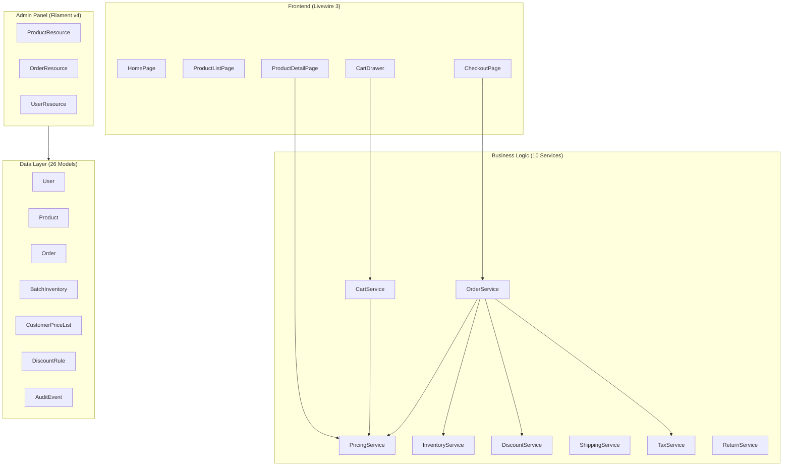
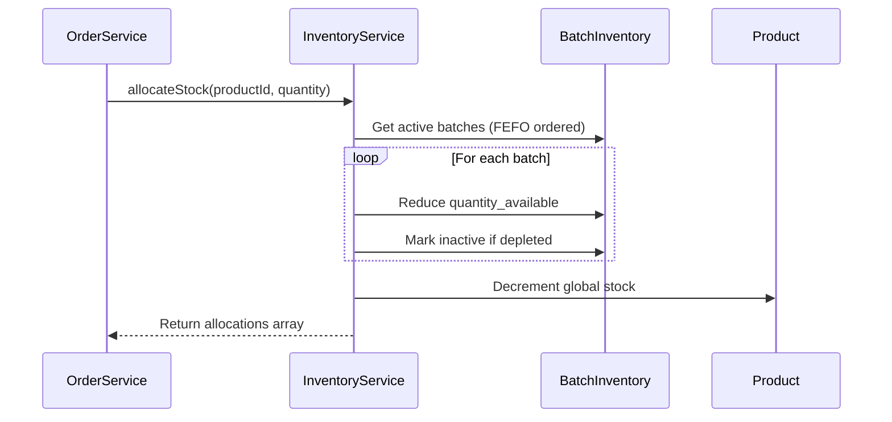
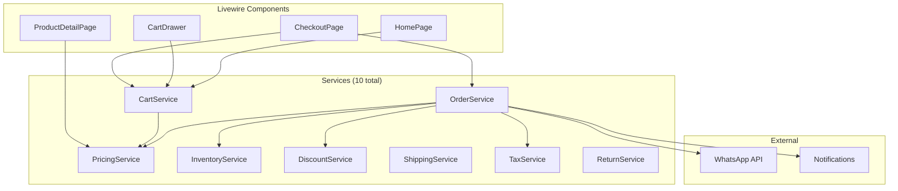
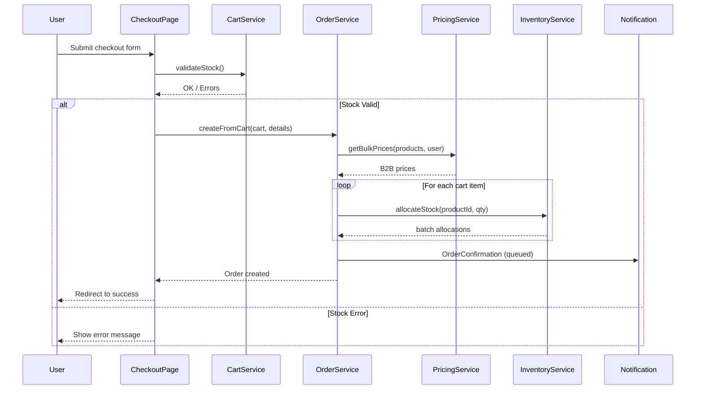
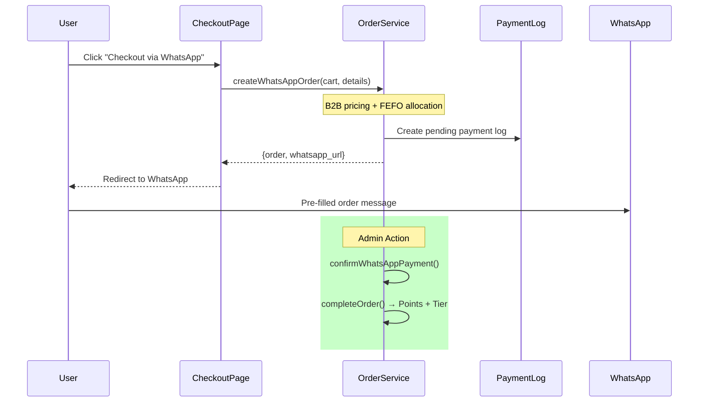
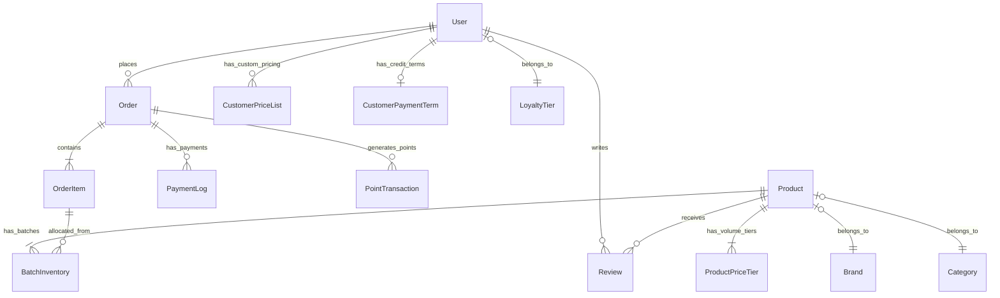

# Alfa Beauty B2B E-Commerce - Analisis Teknis Lengkap

> **Proyek:** PT. Alfa Beauty Cosmetica - B2B Hair Care Website  
> **Stack:** Laravel 12 + PHP 8.2 + Livewire 3 + Filament v4 + PostgreSQL (Supabase)  
> **Deployment:** Vercel Serverless  
> **Tanggal Analisis:** 4 Januari 2026 (Updated)  
> **Total Files (first-party):** ~330+ (app/routes/resources/database/tests/lang/api)

---

## 📋 Table of Contents

1. [Executive Summary](#executive-summary)
2. [Arsitektur Sistem](#arsitektur-sistem)
3. [Core Business Logic](#core-business-logic)
4. [Service Layer Architecture](#service-layer-architecture)
5. [Data Flow Diagrams](#data-flow-diagrams)
6. [Database Schema](#database-schema)
7. [Livewire Components](#livewire-components)
8. [Frontend Architecture](#frontend-architecture)
9. [Design Patterns](#design-patterns)
10. [Compliance & Security](#compliance--security)
11. [Code Quality & Status](#code-quality--status)
12. [Recent Updates](#recent-updates)

---

## Executive Summary

### Reference Baseline (B2B Best Practice)

Pedoman fitur & operasi B2B berbasis referensi Bagisto + BigCommerce dirangkum di: [docs/b2b_best_practices_baseline.md](docs/b2b_best_practices_baseline.md)

### Key Metrics

| Metric | Value | Notes |
|--------|-------|-------|
| **Models** | 26 entities | `app/app/Models` (+AuditEvent) |
| **Livewire Components** | 16 components | `app/app/Livewire` |
| **Services** | 10 services | `app/app/Services` (+AuditEvent, Return, Permission) |
| **Migrations** | 50 migrations | `database/migrations` |
| **Admin Resources** | 9 resources (Filament) | `app/app/Filament/Admin/Resources` |
| **API Endpoints** | 12 endpoints | `routes/api.php` (prefix `/api/v1`) |
| **Tests** | 37 files | 288 tests (Unit: 39, Feature: 249) |
| **CSS** | ITCSS Architecture | `public/css/main.css` (8,500+ lines) |
| **Languages** | ID + EN (26 files) | 13 files per locale |
| **Blade Templates** | 16 views | `resources/views/livewire` |
| **Notifications** | 3 queueable | OrderConfirmation, PaymentReceived, TierUpgraded |
| **Seeders** | 7 seeders | `database/seeders` |

### Audit Methodology (Reproducible)

**Scope (first-party only):** `app/`, `routes/`, `resources/`, `database/`, `tests/`, `lang/`, `api/` (total 317 files). Folder seperti `vendor/` dan output build tidak dihitung.

**Reproducible commands (PowerShell, dari folder `app/`):**

```powershell
# LOC (first-party PHP)
$phpPaths=@('app','routes','database','tests','lang','api')
$phpFiles=@(); foreach($p in $phpPaths){ $phpFiles += Get-ChildItem -Path $p -Recurse -File -Filter *.php }
($phpFiles | ForEach-Object { (Get-Content $_.FullName | Measure-Object -Line).Lines } | Measure-Object -Sum).Sum

# LOC (Blade)
$bladeFiles=Get-ChildItem -Path 'resources\views' -Recurse -File -Filter *.blade.php
($bladeFiles | ForEach-Object { (Get-Content $_.FullName | Measure-Object -Line).Lines } | Measure-Object -Sum).Sum

# LOC (main.css) — gunakan -Raw untuk konsisten dengan line counter editor
$t = Get-Content 'public\css\main.css' -Raw
($t -split "`n").Count

# Exact test count (tanpa eksekusi)
php artisan test --list-tests --testsuite=Unit | Select-String '::' | Measure-Object | Select-Object -ExpandProperty Count
php artisan test --list-tests --testsuite=Feature | Select-String '::' | Measure-Object | Select-Object -ExpandProperty Count
```

**Measured (2026-01-02):**
- PHP files: 279 | PHP LOC: 20,965
- Blade files: 29 | Blade LOC: 3,606
- `main.css`: 8,425 lines (counted via `-Raw` split on LF)
- Tests: Unit 39, Feature 249 (Total 288) via `--list-tests`

**Test execution note:** Saat `php artisan test --testsuite=Feature` dijalankan pada environment ini, banyak test gagal (exit code 1). Ini tidak mengubah inventory/jumlah test, namun menunjukkan ada dependency runtime (mis. konfigurasi environment, asset/view assumptions, atau API test yang melakukan `file_get_contents(...)`) yang perlu distabilkan jika targetnya green CI.

### Core Features

- **4-Level B2B Pricing Engine** - Customer-specific, volume, loyalty, base pricing
- **FEFO Inventory Management** - First Expired First Out for BPOM compliance
- **Loyalty Points System** - Tier-based discounts with point multipliers + period tracking
- **WhatsApp-First Checkout** - Optimized for Indonesian B2B transactions
- **Review System** - Verified buyer testimonials with +50 bonus points
- **Cron Jobs** - Automated cleanup orders, sync inventory, update expiry status
- **Flexible Discount System** - Buy X Get Y, percentage, fixed amount, bundle pricing
- **Tax/PPN Compliance** - e-Faktur ready with 11% PPN tracking
- **MOQ System** - Product & customer-level minimum order quantity
- **Returns & Cancellations** - Full refund workflow with restocking support
- **Shipping Calculator** - Zone-based pricing with volumetric weight

---

## Arsitektur Sistem

### Technology Stack

| Layer | Technology | Version |
|-------|------------|---------|
| **Backend** | PHP + Laravel | 12.x |
| **Frontend** | Livewire + Alpine.js | 3.x |
| **Admin Panel** | Filament | ^4.3 |
| **Database** | PostgreSQL (Supabase) | Production |
| **Session** | Database driver | Serverless-safe |
| **Styling** | Vanilla CSS (ITCSS) | 8,500+ LOC |
| **API** | RESTful + Sanctum | `/api/v1/*` |
| **Deployment** | Vercel (Serverless) | - |

**Frontend Tooling:** Vite ^7.0

### System Architecture Diagram



### File Structure

```
app/
├── api/
│   ├── index.php                   # Vercel entry point
│   └── cron/                       # 3 automated cron jobs
│       ├── cleanup-orders.php
│       ├── sync-inventory.php
│       └── update-expiry.php
├── app/
│   ├── Filament/Admin/Resources/   # 9 Filament resources
│   ├── Http/Controllers/Api/V1/    # 6 API controllers
│   ├── Livewire/                   # 16 components
│   ├── Models/                     # 26 entities
│   ├── Notifications/              # 3 queueable notifications
│   ├── Services/                   # 10 business services
│   ├── Observers/                  # 3 model observers
│   └── Policies/                   # 2 authorization policies
├── database/
│   ├── migrations/                 # 50 migrations
│   └── seeders/                    # 7 seeders
├── resources/views/livewire/       # 16 Blade templates
├── public/css/main.css             # 8,500+ LOC ITCSS
└── lang/{id,en}/                   # 13 files per locale
```

---

## Core Business Logic

### 1. B2B Pricing Engine

The pricing system follows a **strict priority order**:

```
PRIORITY 1: Customer-Specific Price (CustomerPriceList)
    │ → Fixed price OR percentage discount
    │ → By product, brand, OR category
    │ → Validity period support
    │
    ▼ (if not found)
PRIORITY 2: Volume Tier Pricing (ProductPriceTier)
    │ → Quantity-based discounts
    │ → e.g., 12+ units = 10% off, 48+ = 20%
    │
    ▼ (if not found)
PRIORITY 3: Loyalty Tier Discount (LoyaltyTier)
    │ → Silver = 5%, Gold = 10%
    │
    ▼ (if not found)
PRIORITY 4: Base Price (Product.base_price)
```

**Implementation:** [PricingService.php](app/app/Services/PricingService.php) - 415 LOC

```php
public function getPrice(Product $product, ?User $user, int $quantity = 1): array
{
    // 1. Customer-specific pricing (highest priority)
    if ($user) {
        $customerPrice = $this->getCustomerPrice($product, $user, $quantity);
        if ($customerPrice !== null) {
            return ['price' => $customerPrice['price'], 'source' => 'customer_price_list'];
        }
    }
    // 2. Volume tier → 3. Loyalty discount → 4. Base price
    // ...
}
```

### 2. FEFO Inventory Algorithm

**FEFO (First Expired First Out)** ensures cosmetics with earliest expiry dates are sold first:

```
ALLOCATION PRIORITY:
1. Near-expiry batches (is_near_expiry = true, < 90 days)
2. Earliest expiry date (FEFO)
3. Earliest received date (FIFO tiebreaker)
```

**Implementation:** [InventoryService.php](app/app/Services/InventoryService.php) - 330 LOC



### 3. Loyalty Points System

**Points Calculation:**

```
Base Points = floor(order_total / 10,000)
Final Points = Base Points × Tier Multiplier

Example:
- Order Total: Rp 5,000,000
- User Tier: Gold (1.5x multiplier)
- Points Earned: floor(5,000,000 / 10,000) × 1.5 = 750 points
```

**Tier Structure:**

| Tier | Min Spend | Discount | Multiplier | Free Shipping |
|------|-----------|----------|------------|---------------|
| **Guest** | Rp 0 | 0% | 1.0x | ❌ |
| **Silver** | Rp 5M/year | 5% | 1.0x | ❌ (min Rp 2.5M) |
| **Gold** | Rp 25M/year | 10% | 1.5x | ✅ Always |

> **Future:** Platinum tier at Rp 75M/year (commented in code)

### 4. Review System

```
1. User submits review (is_approved = false)
2. System checks is_verified (purchased product?)
3. Admin approves review (is_approved = true)
4. System awards +50 bonus points (one-time)
5. Review appears on product page
```

---

## Service Layer Architecture

### Service Dependency Graph



### Service Details

| Service | Purpose | Key Methods |
|---------|---------|-------------|
| [CartService](app/app/Services/CartService.php) | Cart state + MOQ validation | `addItem()`, `getSubtotal()`, `validateStock()`, `refreshPrices()` |
| [OrderService](app/app/Services/OrderService.php) | Order lifecycle + WhatsApp | `createFromCart()`, `createWhatsAppOrder()`, `completeOrder()` |
| [PricingService](app/app/Services/PricingService.php) | B2B pricing engine | `getPrice()`, `getBulkPrices()`, `getCustomerPrice()` |
| [InventoryService](app/app/Services/InventoryService.php) | FEFO allocation | `allocateStock()`, `releaseStock()`, `syncStockWithBatches()` |
| [DiscountService](app/app/Services/DiscountService.php) | Flexible discount engine | `getApplicableDiscounts()`, `calculateBestDiscounts()` |
| [ShippingService](app/app/Services/ShippingService.php) | Zone-based shipping | `calculateShippingCost()`, `detectZoneFromAddress()` |
| [TaxService](app/app/Services/TaxService.php) | PPN 11% + e-Faktur | `calculateItemTax()`, `formatForEFaktur()` |
| [ReturnService](app/app/Services/ReturnService.php) | Returns & refunds | `createReturn()`, `approveReturn()`, `processRefund()` |
| [AuditEventService](app/app/Services/AuditEventService.php) | Audit logging | `log()`, `getEventsForOrder()` |
| [PermissionService](app/app/Services/PermissionService.php) | Authorization helper | `canAccess()`, `hasPermission()` |

---

## Data Flow Diagrams

### Standard Checkout Flow



### WhatsApp Checkout Flow



---

## Database Schema

### Entity Relationship Diagram



### Model Summary (26 Models)

| Model | Key Features |
|-------|--------------|
| [User](app/app/Models/User.php) | B2B attrs, points, tier, credit terms, `addPoints()`, `updateTier()` |
| [Product](app/app/Models/Product.php) | BPOM, pricing, stock, weight, UoM, `priceTiers()`, `batches()` |
| [Order](app/app/Models/Order.php) | WhatsApp message generation, status constants, tax columns |
| [BatchInventory](app/app/Models/BatchInventory.php) | FEFO, expiry tracking, supplier link, `reduceStock()` |
| [CustomerPriceList](app/app/Models/CustomerPriceList.php) | B2B pricing rules, validity periods |
| [CustomerPaymentTerm](app/app/Models/CustomerPaymentTerm.php) | NET30/NET60 credit, `canUseCredit()` |
| [CustomerOrderSetting](app/app/Models/CustomerOrderSetting.php) | Per-customer MOQ, credit limits, free shipping |
| [ProductPriceTier](app/app/Models/ProductPriceTier.php) | Volume discounts, `calculateUnitPrice()` |
| [ProductMoqOverride](app/app/Models/ProductMoqOverride.php) | Customer/tier-specific MOQ overrides |
| [DiscountRule](app/app/Models/DiscountRule.php) | Flexible discounts: percentage, fixed, Buy X Get Y, bundle |
| [OrderDiscount](app/app/Models/OrderDiscount.php) | Tracks applied discounts per order |
| [OrderReturn](app/app/Models/OrderReturn.php) | Return requests with status workflow |
| [ReturnItem](app/app/Models/ReturnItem.php) | Individual return line items |
| [OrderCancellation](app/app/Models/OrderCancellation.php) | Order void with refund tracking |
| [Supplier](app/app/Models/Supplier.php) | Vendor management for batch tracking |
| [UserLoyaltyPeriod](app/app/Models/UserLoyaltyPeriod.php) | Period-based tier tracking |
| [Review](app/app/Models/Review.php) | Verified buyer, +50 points, `approve()` |
| [PaymentLog](app/app/Models/PaymentLog.php) | Tax compliance, soft deletes, idempotency |
| [LoyaltyTier](app/app/Models/LoyaltyTier.php) | Tier configuration with period type |
| [PointTransaction](app/app/Models/PointTransaction.php) | Points audit trail |
| [Cart](app/app/Models/Cart.php) | Session/user based |
| [CartItem](app/app/Models/CartItem.php) | Product eager loading, `price_at_add` |
| [Category](app/app/Models/Category.php) | Self-referential hierarchy |
| [Brand](app/app/Models/Brand.php) | Brand management |
| [OrderItem](app/app/Models/OrderItem.php) | Batch allocations JSON, tax columns |
| [AuditEvent](app/app/Models/AuditEvent.php) | Audit logging for compliance |

---

## Livewire Components

| Component | Key Features |
|-----------|--------------|
| [CheckoutPage](app/app/Livewire/CheckoutPage.php) | WhatsApp + standard checkout, stock/MOQ validation, B2B savings |
| [ProductDetailPage](app/app/Livewire/ProductDetailPage.php) | Volume pricing display, dynamic price updates, quantity controls |
| [ProductListPage](app/app/Livewire/ProductListPage.php) | Filters, pagination, search, clearFilters() |
| [ReviewForm](app/app/Livewire/ReviewForm.php) | Star rating, verified buyer check |
| [CartDrawer](app/app/Livewire/CartDrawer.php) | Slide-out cart, quantity updates, B2B discount badges |
| [ProductReviews](app/app/Livewire/ProductReviews.php) | Display approved reviews |
| [BrandDetail](app/app/Livewire/BrandDetail.php) | Brand products with filtering |
| [BuyItAgain](app/app/Livewire/BuyItAgain.php) | Repeat purchase suggestions |
| [RegisterPage](app/app/Livewire/RegisterPage.php) | User registration form |
| [LoginPage](app/app/Livewire/LoginPage.php) | Authentication form |
| [HomePage](app/app/Livewire/HomePage.php) | Featured products, hero section, stats |
| [OrderSuccess](app/app/Livewire/OrderSuccess.php) | Order confirmation with ownership verification |
| [ProductCard](app/app/Livewire/ProductCard.php) | Reusable product card with OOS badge |
| [ProductList](app/app/Livewire/ProductList.php) | Products grid |
| [MyOrders](app/app/Livewire/MyOrders.php) | Order history with custom pagination |
| [CartCounter](app/app/Livewire/CartCounter.php) | Header cart badge |

### Routing Structure

| Route | Component | Auth | Description |
|-------|-----------|------|-------------|
| `/` | HomePage | ❌ | Landing page with featured products |
| `/products` | ProductListPage | ❌ | Product catalog with filters |
| `/products/{slug}` | ProductDetailPage | ❌ | Product details with pricing |
| `/brands/{slug}` | BrandDetail | ❌ | Brand products page |
| `/checkout` | CheckoutPage | ✅ | Cart checkout flow |
| `/checkout/success/{order}` | OrderSuccess | ✅ | Order confirmation (owner verified) |
| `/orders` | MyOrders | ✅ | User order history |
| `/login` | LoginPage | ❌ | User authentication |
| `/register` | RegisterPage | ❌ | New user signup |
| `/logout` | - | ✅ | Session logout |
| `/lang/{locale}` | - | ❌ | Language switch (id/en) |
| `/admin/*` | Filament Panel | ✅ | Admin dashboard |

---

## Frontend Architecture

### Blade Templates

| Template | Lines | Key Features |
|----------|-------|--------------|
| [home-page.blade.php](app/resources/views/livewire/home-page.blade.php) | 312 | Alpine.js testimonial carousel |
| [product-reviews.blade.php](app/resources/views/livewire/product-reviews.blade.php) | 290 | Star ratings, verified badges |
| [review-form.blade.php](app/resources/views/livewire/review-form.blade.php) | 229 | Rating selection, form validation |
| [product-detail-page.blade.php](app/resources/views/livewire/product-detail-page.blade.php) | 217 | Volume pricing tiers |
| [checkout-page.blade.php](app/resources/views/livewire/checkout-page.blade.php) | 179 | B2B savings banner, stock errors |
| [cart-drawer.blade.php](app/resources/views/livewire/cart-drawer.blade.php) | 152 | Slide-out cart UI |
| [product-list-page.blade.php](app/resources/views/livewire/product-list-page.blade.php) | 115 | Filter sidebar, product grid |
| [brand-detail.blade.php](app/resources/views/livewire/brand-detail.blade.php) | 109 | Brand hero, products list |
| [register-page.blade.php](app/resources/views/livewire/register-page.blade.php) | 87 | Signup form |
| [my-orders.blade.php](app/resources/views/livewire/my-orders.blade.php) | 70 | Order list cards |
| [buy-it-again.blade.php](app/resources/views/livewire/buy-it-again.blade.php) | 62 | Repeat purchase UI |
| [login-page.blade.php](app/resources/views/livewire/login-page.blade.php) | 55 | Login form |
| [product-card.blade.php](app/resources/views/livewire/product-card.blade.php) | 38 | Reusable product card |
| [order-success.blade.php](app/resources/views/livewire/order-success.blade.php) | 36 | Order confirmation |

### CSS Architecture (8,425 lines - ITCSS)

| Section | Purpose |
|---------|---------|
| **Settings** | CSS variables: colors, typography, spacing |
| **Base** | Reset, typography defaults, navigation |
| **Components** | Buttons, product cards, toast notifications |
| **Layout** | Hero, products grid, checkout |
| **B2B Pricing** | Volume tiers, discount badges |
| **Testimonials** | Clean card carousel |

### Design System

| Token | Value | Usage |
|-------|-------|-------|
| `--black` | #0A0A0A | Primary text |
| `--white` | #FFFFFF | Background |
| `--gold` | #C9A962 | Gold tier badge |
| `--silver` | #94A3B8 | Silver tier badge |
| `--green` | #10B981 | Success/In Stock |
| `--red` | #dc2626 | Error/Out of Stock |

**Typography:** Instrument Serif (headings), Inter (body)

---

## Design Patterns

### 1. Single Responsibility Principle

| Service | Responsibility |
|---------|---------------|
| CartService | Cart state management |
| OrderService | Order lifecycle |
| PricingService | Price calculation |
| InventoryService | Stock management |

### 2. Dependency Injection

```php
public function __construct(
    InventoryService $inventoryService,
    PricingService $pricingService
) { ... }
```

### 3. Transaction Safety

```php
return DB::transaction(function () {
    // Atomic operations
});
```

### 4. Graceful Degradation

```php
try {
    // Full B2B query with brand_id, category_id
} catch (\Exception $e) {
    // Fallback: Simple product_id-only query
    Log::warning('B2B pricing fallback');
}
```

### 5. Query Optimization

```php
// ❌ Bad: N+1 queries
foreach ($items as $item) {
    $price = $service->getPrice($item->product);
}

// ✅ Good: Single bulk query
$prices = $service->getBulkPrices($products, $user);
```

---

## Compliance & Security

### BPOM (Cosmetics Regulation)

| Requirement | Implementation |
|-------------|-----------------|
| Batch tracking | `BatchInventory` model |
| Expiry management | FEFO algorithm |
| Lot traceability | `OrderItem.batch_allocations` JSON |
| 6-year retention | Soft deletes + archival |
| BPOM number display | `Product.bpom_number` field |

### UU KUP (Tax Law)

| Requirement | Implementation |
|-------------|-----------------|
| Payment audit trail | `PaymentLog` model with soft deletes |
| 10-year retention | Data archival policy |
| Transaction logging | All operations logged |

### UU PDP (Data Protection)

| Requirement | Implementation |
|-------------|-----------------|
| Session-based tracking | Cookie consent ready |
| Data minimization | Only essential fields |
| Audit trail | `PointTransaction` records |

---

## Code Quality & Status

### Strengths ✅

1. **Modern Stack**: Laravel 12 + Livewire 3 + Filament v4 + PHP 8.2
2. **Clean Architecture**: Models, Services, Livewire properly separated (SRP)
3. **Compliance-Ready**: BPOM, UU KUP, UU PDP built-in with batch tracking
4. **i18n Ready**: Indonesian + English (26 lang files total)
5. **Responsive Design**: Mobile-first dengan ITCSS (`main.css` 8,425 lines)
6. **WhatsApp Integration**: B2B-friendly checkout with pre-filled messages
7. **RESTful API**: Complete v1 with Sanctum authentication (12 endpoints)
8. **Comprehensive Tests**: 37 test files (288 tests via `--list-tests`)
9. **B2B Pricing Engine**: 4-level priority system with bulk operations
10. **FEFO Inventory**: Batch-level stock management with expiry tracking
11. **Serverless Ready**: Vercel deployment with cron jobs configured
12. **Performance Optimized**: N+1 safe with bulk queries and caching
13. **Route Protection**: Auth middleware on checkout/orders with ownership verification

### Test Coverage (Aktual)

| Category | Test Files | Notes |
|----------|-----------|-------|
| **Feature Tests** | 30 files | Termasuk `tests/Feature/Api/*` |
| **Unit Tests** | 6 files | Model + domain unit tests |
| **TestCase.php** | 1 file | Base test case |
| **TOTAL** | **37 files** | 288 tests (Unit 39 / Feature 249) |

### Completed Improvements ✅

1. ✅ Fixed User model fillable fields (B2B attributes)
2. ✅ Removed 18 duplicate Filament resources (9 remain)
3. ✅ Added stock validation at checkout (validateStockBeforeCheckout)
4. ✅ Created RESTful API v1 (12 endpoints with Sanctum auth)
5. ✅ Added comprehensive tests (63 tests across 9 classes)
6. ✅ Implemented queue notifications (3 queueable: OrderConfirmation, PaymentReceived, TierUpgraded)
7. ✅ Installed Laravel Sanctum for API auth
8. ✅ Added B2B pricing engine (415 LOC with caching)
9. ✅ Added FEFO inventory management (330 LOC with batch tracking)
10. ✅ Added product reviews with +50 bonus points
11. ✅ Implemented WhatsApp checkout flow with pre-filled messages
12. ✅ Added cron jobs for order cleanup and inventory sync
13. ✅ Added bilingual support (Indonesian + English, 26 files)
14. ✅ Implemented Vercel serverless deployment configuration
15. ✅ **NEW:** Added weight & UoM columns for shipping calculation
16. ✅ **NEW:** Added PPN 11% tax columns to orders/items (e-Faktur ready)
17. ✅ **NEW:** Added partial payment tracking (amount_paid, balance_due, payment_due_date)
18. ✅ **NEW:** Created order returns & cancellations tables with refund workflow
19. ✅ **NEW:** Added loyalty period tracking (yearly/quarterly tier reset)
20. ✅ **NEW:** Fixed batch_inventory unique constraint (supplier_id added)
21. ✅ **NEW:** Created flexible discount system (Buy X Get Y, bundle, stackable)
22. ✅ **NEW:** Added customer-level MOQ configuration
23. ✅ **NEW:** Added check constraint for customer_price_lists targeting
24. ✅ **NEW:** Added composite performance indexes for products/orders/carts
25. ✅ **NEW:** Created DiscountService for complex promotions
26. ✅ **NEW:** Created ShippingService with zone-based pricing
27. ✅ **NEW:** Created TaxService with e-Faktur formatting
28. ✅ **NEW:** Fixed N+1 queries in HomePage, ProductList, BrandDetail, ProductDetailPage
29. ✅ **NEW:** Added MOQ validation in CartService with increment enforcement
30. ✅ **NEW:** Added defensive MOQ validation in OrderService
31. ✅ **NEW:** Created reviews.php translation files (EN + ID)
32. ✅ **NEW:** Added auth middleware to checkout & order success routes
33. ✅ **NEW:** Added order ownership verification in OrderSuccess component
34. ✅ **NEW:** Fixed CartDrawer toggle-cart event duplication (Alpine.js handles state)
35. ✅ **NEW:** Created clearFilters() method in ProductListPage (fixed invalid $set syntax)
36. ✅ **NEW:** Fixed CartCounter DI pattern (boot() method)
37. ✅ **NEW:** Replaced hardcoded strings in BuyItAgain with translation keys
38. ✅ **NEW:** Added 37 test files (288 tests via `--list-tests`, sebelumnya 63 tests)
39. ✅ **NEW:** Created Unit tests for models: Product, User, Order, LoyaltyTier, Review
40. ✅ **NEW:** Created reviews table migration (was missing, only model existed)
41. ✅ **NEW:** Added User model relationships: cart(), reviews()
42. ✅ **NEW:** Added Product model relationships: reviews(), approvedReviews()
43. ✅ **NEW:** Fixed ReviewForm Livewire hydration bug (?Order → ?int orderId)
44. ✅ **NEW:** Fixed Livewire multiple root elements in review views

### Future Enhancements (Optional)

1. Payment gateway integration (Midtrans/Xendit)
2. CRM integration (Salesforce/HubSpot)
3. Advanced analytics dashboard
4. Search dengan Algolia/Meilisearch
5. Push notifications for order updates
6. Automated invoice generation (PDF)
7. Multi-warehouse support
8. Customer self-service credit management

---

## 📊 File Statistics

| Category | Count | Notes |
|----------|-------|-------|
| PHP Models | 26 files | `app/app/Models` |
| PHP Services | 10 files | `app/app/Services` |
| Livewire Components | 16 files | `app/app/Livewire` |
| Blade Templates | 16 files | `resources/views/livewire` |
| Migration Files | 50 files | `database/migrations` |
| Language Files | 26 files | ID + EN, 13 per locale |
| CSS Files | 1 file | `main.css` (8,500+ lines) |
| Tests | 37 files | 288 tests (Unit 39 / Feature 249) |
| Filament Resources | 9 resources | `app/Filament/Admin/Resources` |
| Notifications | 3 files | Queueable |
| Seeders | 7 files | `database/seeders` |
| API Controllers | 6 files | `app/Http/Controllers/Api/V1` |
| Cron Jobs | 3 files | `api/cron` |
| **TOTAL (first-party)** | **~330+ files** | - |

---

## 🔧 API Endpoints (v1)

| Endpoint | Method | Auth | Description |
|----------|--------|------|-------------|
| `/api/v1/products` | GET | ❌ | List products with filters |
| `/api/v1/products/{slug}` | GET | ❌ | Get product details |
| `/api/v1/brands` | GET | ❌ | List all brands |
| `/api/v1/brands/{slug}` | GET | ❌ | Get brand details |
| `/api/v1/categories` | GET | ❌ | List all categories |
| `/api/v1/user` | GET | ✅ | Get authenticated user profile |
| `/api/v1/user` | PUT | ✅ | Update user profile |
| `/api/v1/orders` | GET | ✅ | List user orders |
| `/api/v1/orders/{order}` | GET | ✅ | Get order details |
| `/api/v1/health` | GET | ❌ | API health check |
| `/api/v1/health/detailed` | GET | ❌ | API health check (detailed) |

---

## 🕐 Cron Jobs (Vercel)

| Job | Schedule | Purpose |
|-----|----------|---------|
| `cleanup-orders.php` | Hourly | Remove orphaned/abandoned orders |
| `sync-inventory.php` | Daily | Sync global stock with batch totals |
| `update-expiry.php` | Daily 02:00 | Update near-expiry flags on batches |

---

## 🆕 Recent Updates (January 1–2, 2026)

### New Migrations (13 added)

| Migration | Purpose |
|-----------|---------|
| `2026_01_01_000001` | Weight & UoM columns for shipping (weight_grams, selling_unit, MOQ) |
| `2026_01_01_000002` | Tax/PPN columns on orders & order_items (e-Faktur ready) |
| `2026_01_01_000003` | Partial payment tracking (amount_paid, balance_due, payment_due_date) |
| `2026_01_01_000004` | Order returns & cancellations tables with refund workflow |
| `2026_01_01_000005` | Loyalty period tracking (yearly/quarterly tier evaluation) |
| `2026_01_01_000006` | Batch inventory supplier_id fix (unique constraint) |
| `2026_01_01_000007` | Flexible discount system (discount_rules, order_discounts) |
| `2026_01_01_000008` | Customer MOQ configuration (customer_order_settings, product_moq_overrides) |
| `2026_01_01_000009` | CustomerPriceList check constraint (at least one FK required) |
| `2026_01_01_000010` | Product performance indexes (7 composite indexes) |
| `2026_01_01_100000` | Reviews table for product testimonials |
| `2026_01_01_200000` | Reviews unique constraint (anti-duplicate per user/order) |
| `2026_01_01_300000` | Additional performance indexes |

### New Models (9 added)

| Model | Purpose |
|-------|---------|
| `CustomerOrderSetting` | Per-customer min order amount, credit limit, shipping rules |
| `DiscountRule` | Flexible promotions: Buy X Get Y, percentage, fixed, bundle |
| `OrderCancellation` | Order void with refund tracking |
| `OrderDiscount` | Tracks applied discounts per order |
| `OrderReturn` | Return requests with status workflow (requested → completed) |
| `ProductMoqOverride` | Customer/tier-specific MOQ overrides |
| `ReturnItem` | Individual return line items with condition tracking |
| `Supplier` | Vendor management for batch inventory |
| `UserLoyaltyPeriod` | Period-based tier tracking with spend history |

### New Services (3 added)

| Service | LOC | Purpose |
|---------|-----|---------|
| `DiscountService` | 350 | Calculate best discounts, apply promo codes, handle stackability |
| `ShippingService` | 250 | Zone-based shipping, volumetric weight, free shipping rules |
| `TaxService` | 200 | PPN 11% calculation, e-Faktur formatting |

### New Seeders (2 added)

| Seeder | Purpose |
|--------|---------|
| `DiscountRuleSeeder` | Sample promo codes (NEWCUSTOMER, BUY5GET1, WEEKEND15, etc.) |
| `SupplierSeeder` | 5 sample Indonesian suppliers with NPWP |

### Performance Optimizations

| Component | Before | After | Improvement |
|-----------|--------|-------|-------------|
| HomePage brands | 9 queries | 1 query | `withCount()` + DB subquery |
| ProductList pricing | N+1 | 1 bulk query | `getBulkPrices()` |
| BrandDetail | 5 queries | 2 queries | `withCount()` + optimized featured |
| ProductDetailPage | 5+ queries | 1 query | `getProduct()` caching |
| CartDrawer increment | Hardcoded +1 | Product's `order_increment` | Dynamic MOQ |

### MOQ (Minimum Order Quantity) System

```
VALIDATION FLOW:
1. CartService::addItem() → validateAndAdjustQuantity()
   - Enforces min_order_qty
   - Rounds to order_increment multiples
   
2. CartDrawer increment/decrement
   - Uses product's order_increment (not hardcoded)
   - Respects min_order_qty as floor
   
3. OrderService::createFromCart() → validateAndCorrectMOQ()
   - Defensive re-validation before order creation
   - Auto-corrects invalid quantities with logging
```

### Tax/e-Faktur Integration

```
NEW COLUMNS:
- orders.subtotal_before_tax (decimal 15,2)
- orders.tax_rate (default 11.00%)
- orders.tax_amount (calculated)
- orders.e_faktur_number (DJP reference)
- order_items.unit_price_before_tax
- order_items.tax_rate, tax_amount, subtotal_before_tax

TaxService.formatForEFaktur() outputs:
- tanggal_faktur, npwp_pembeli, nama_pembeli
- dpp, ppn, tarif_ppn, items[]
```

---

## 🆕 Latest Updates (January 3-4, 2026)

### Session & Authentication Fixes

| Issue | Fix Applied |
|-------|-------------|
| Session loss after checkout | Changed `SESSION_DRIVER` from cookie to database |
| Serverless session compatibility | Created `sessions` table migration |
| PostgreSQL boolean queries | Fixed `where` to `whereRaw('column = true')` in Models |
| Checkout silent failures | Added try-catch + logging to validation methods |
| Order success flash loss | Passed success via URL query params instead of session |

### New Migrations (January 3-4)

| Migration | Purpose |
|-----------|---------|
| `2026_01_02_000001` | Idempotency columns for orders |
| `2026_01_02_000002` | Pricing trace columns for order_items |
| `2026_01_02_000010` | Point transactions integrity |
| `2026_01_03_000001` | Audit events table |
| `2026_01_03_000020-062` | Reviews/loyalty/returns integrity |
| `2026_01_04_000001` | Sessions table for database driver |

### Translation Keys Added

| File | Keys Added |
|------|------------|
| `lang/id/nav.php` | `home` → "Beranda" |
| `lang/id/orders.php` | `pending_payment` → "Menunggu Pembayaran" |
| `lang/id/products.php` | `out_of_stock` → "Stok Habis" |
| `lang/en/*.php` | English equivalents |

### UX Improvements (January 4)

| Component | Fix |
|-----------|-----|
| Product Card | OOS badge + disabled Quick Add button |
| Cart Drawer | Discount badge positioned inside product image |
| My Orders | Custom pagination with page numbers |
| toast-notifications | Error type shows X icon (not info icon) |

### Code Cleanup for Handover

- Removed 14 debug/temp files (test_db.php, .env.debug, SQL scripts, etc.)
- Removed `$debugError` property from CheckoutPage.php
- Updated DEVELOPER_NOTES.md with PostgreSQL boolean compatibility note

---

*Dokumen ini diperbarui pada 4 Januari 2026 berdasarkan analisis 330+ file.*
*Last updated: January 2, 2026 - Refreshed counts, service LOC, endpoints, migrations, and test inventory.*
